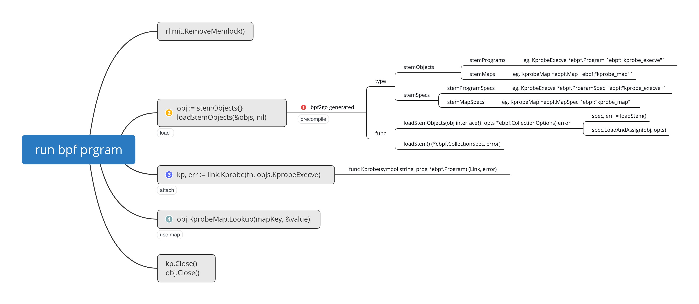

## Rewrite [kprobe program](https://github.com/ZhengjunHUO/bpflearn/blob/main/kprobe/kprobe.go) with [cilium/ebpf](https://github.com/cilium/ebpf)
```bash
# Precompile bpf program in container
export MOUNT_DIR=$(pwd)
docker run --rm --user "0:0" -v $MOUNT_DIR:/kprobe -w /kprobe "quay.io/cilium/ebpf-builder:1637058444" go generate ./...
# Generated files: kprobe_bpfeb.go, kprobe_bpfeb.o, kprobe_bpfel.go, kprobe_bpfel.o
# Load & Run
go run ./kprobe/
```

## Mind map

